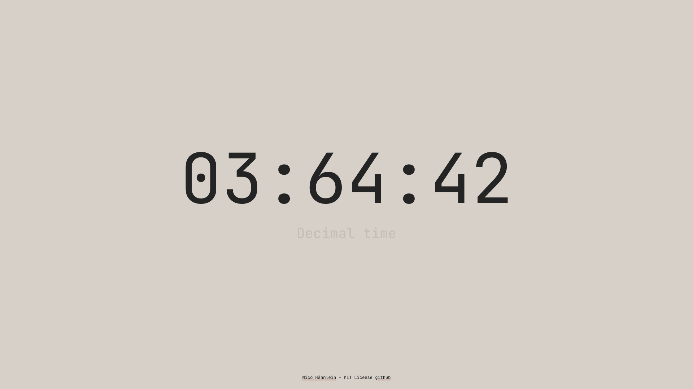

# decimal time clock

This is just a simple [decimal time](https://en.wikipedia.org/wiki/Decimal_time) clock in pure javascript.



## Demo

See the clock in [action](http://decimalclock.nico.nrw/).

## What is decimal time?

A day have 10h,  
a hour 100min,  
and a minute 100sec.  
Just that simple.  
If you want read more about it - oben a new tap!


## Custom install

1. If you want use the clock in your Webseite you only need a html Tag with the id `clock`   
Example: 

```
<div id="clock"></div>
```

2. next you must include the `decTime.js` on the end (after `</body>`) of your website.  
Example: 

```
</body>
<script src="js/decTime.js"></script> 
```

3. if you want only hours and minutes, open decTime.js and edit Line 47 / 50
4. for more customizations read the comments in `decTime.js`


## License

MIT License

Copyright (c) 2022 Nico Hähnlein

Permission is hereby granted, free of charge, to any person obtaining a copy
of this software and associated documentation files (the "Software"), to deal
in the Software without restriction, including without limitation the rights
to use, copy, modify, merge, publish, distribute, sublicense, and/or sell
copies of the Software, and to permit persons to whom the Software is
furnished to do so, subject to the following conditions:

The above copyright notice and this permission notice shall be included in all
copies or substantial portions of the Software.

THE SOFTWARE IS PROVIDED "AS IS", WITHOUT WARRANTY OF ANY KIND, EXPRESS OR
IMPLIED, INCLUDING BUT NOT LIMITED TO THE WARRANTIES OF MERCHANTABILITY,
FITNESS FOR A PARTICULAR PURPOSE AND NONINFRINGEMENT. IN NO EVENT SHALL THE
AUTHORS OR COPYRIGHT HOLDERS BE LIABLE FOR ANY CLAIM, DAMAGES OR OTHER
LIABILITY, WHETHER IN AN ACTION OF CONTRACT, TORT OR OTHERWISE, ARISING FROM,
OUT OF OR IN CONNECTION WITH THE SOFTWARE OR THE USE OR OTHER DEALINGS IN THE
SOFTWARE.